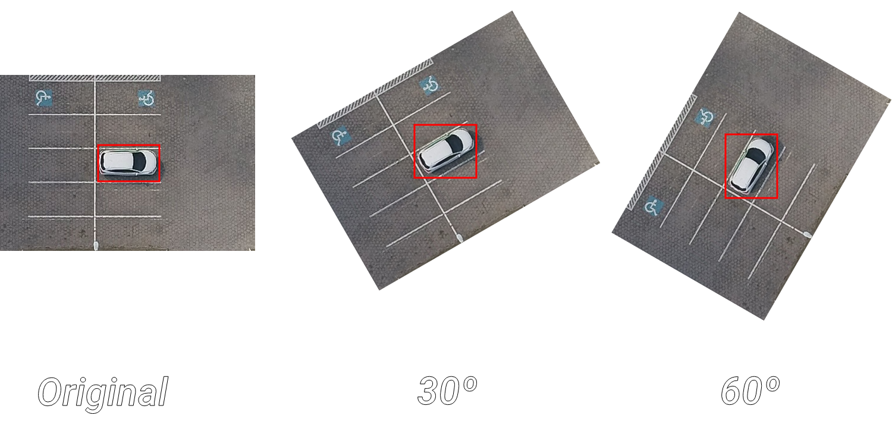
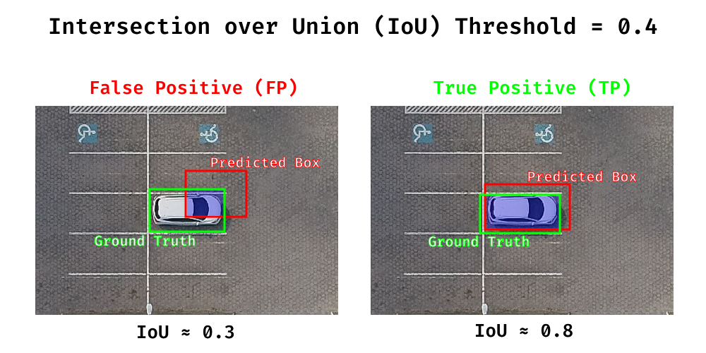
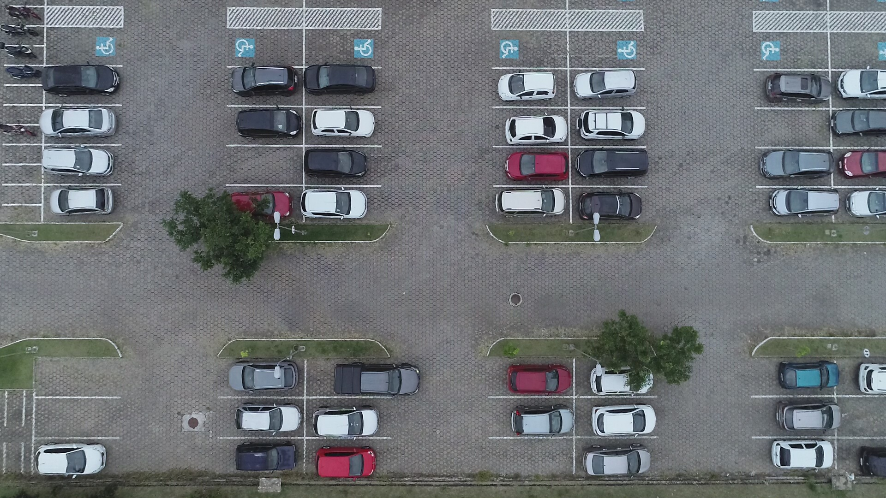
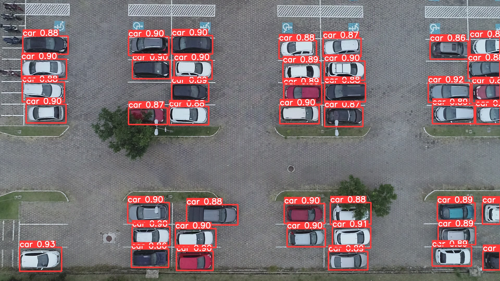
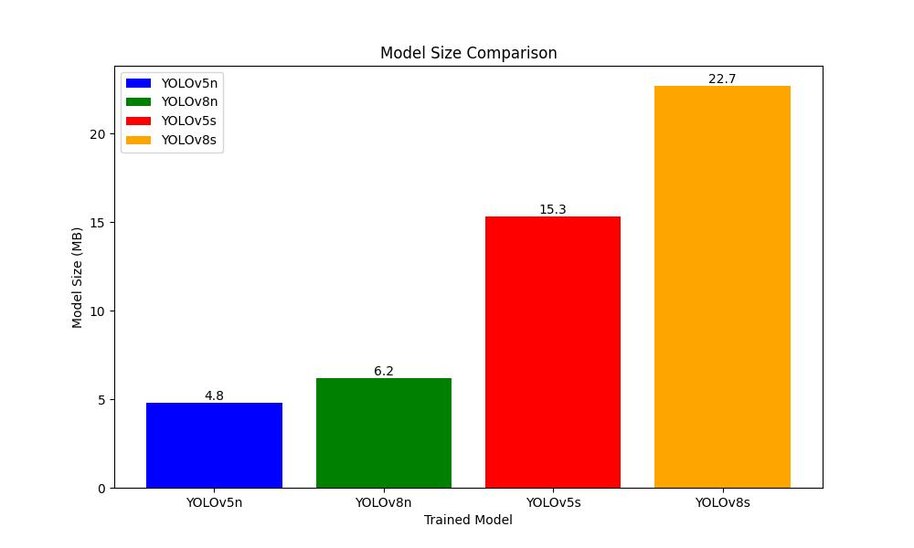
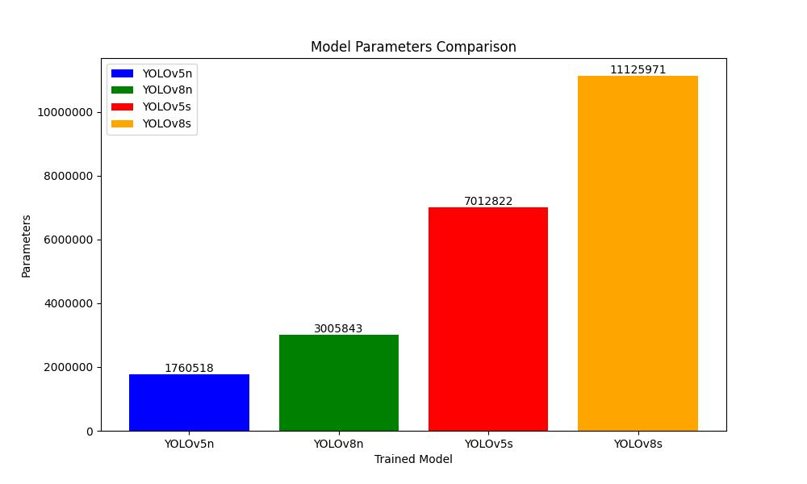
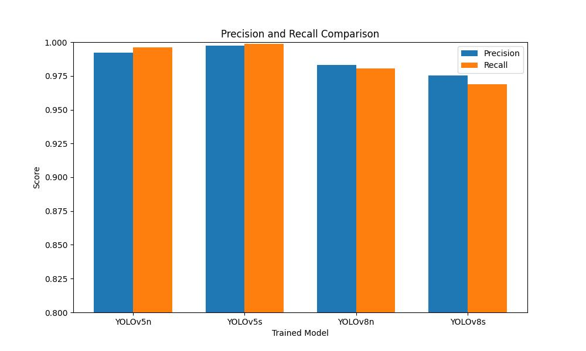
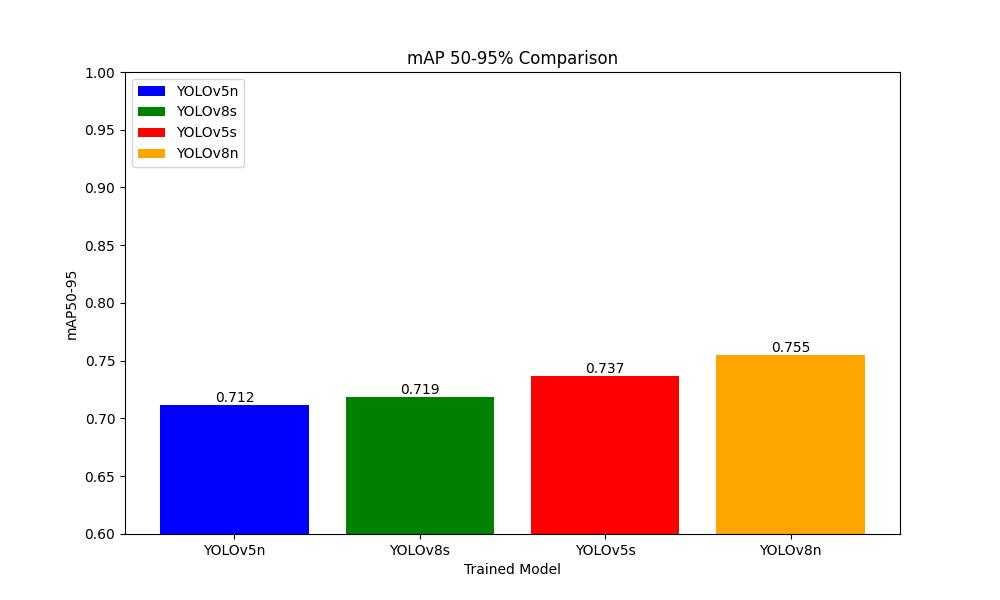

# 
YOLO Parking Spot

## Overview
In this project, we trained four YOLO models on images get by drone from the Unifesp (Federal University of São Paulo) parking lot to detect cars. The goal is to gather information and potentially develop a parking solution to enhance traffic flow and optimize space utilization. By identifying cars, we generate a report with image details such as the number of available parking spots, the number of cars in transit, parked cars, etc.

We documented our project in a research paper, providing detailed explanations of our methodologies, experimental setup, and results. Additionally, we created a YouTube video where we showcased the project and demonstrated its functionalities.

  

## Table of contents
- [Authors](#authors)
- [YOLO Introduction](#yolo-introduction)
- [Training](#training)
- [Model Usage](#model-usage)
- [Model Comparison](#model-comparison)
  - [Size](#size)
  - [Parameters](#parameters)
  - [Precision and Recall](#precision-and-recall)
  - [mAP](#map-50-95)
- [Results Comparison](#results-comparison)
- [Conclusion](#conclusion)
- [Additional Information](#additional-information)
- [License](#license)

## Authors
- [Matheus Silva](https://www.github.com/matheuxito) | [LinkedIn](https://www.linkedin.com/in/matheuxito/)
- [Marcos Lucas](https://www.github.com/lmarcosz) | [LinkedIn](https://www.linkedin.com/in/marcos-l-silva/)
  
## YOLO Introduction
YOLO (You Only Look Once) is an object detection algorithm that performs real-time object detection in images. It's widely used due to its speed and accuracy. In our project, we utilized YOLOv5 and YOLOv8 models for training. You can find the repository for YOLOv5 [here](https://github.com/ultralytics/yolov5) and YOLOv8 [here](https://github.com/ultralytics/ultralytics).

## Training
To train our models, we employed specific strategies. Since we only had 23 images, we decided to use the 2-fold cross-validation method. This approach involves dividing the dataset into two subsets: training and testing.

To address the limited amount of training data, we applied a data augmentation algorithm to the training images. In addition to tripling the number of training images by performing rotations of 30º and 60º, this augmentation technique allowed our models to learn to identify cars with better accuracy. By introducing variations in the training dataset, we enhanced the model's ability to generalize and detect cars from different perspectives.

  

During the training process, the models were trained using the YOLO (You Only Look Once) algorithm. This algorithm is widely used for object detection tasks. The training involves optimizing the model's parameters to accurately detect cars in the parking lot images.

One important aspect of the training process is the IoU (Intersection over Union) threshold. The IoU threshold determines the level of overlap required between the predicted bounding box and the ground truth bounding box to consider it a correct detection. Typically, a threshold of 0.5 is used, which means that the predicted bounding box must have an overlap of at least 50% with the ground truth bounding box to be considered a valid detection.

  

In the example image, we can observe the evaluation of two bounding boxes. On the left side, there is a false positive example with an IoU threshold of 0.3. The predicted bounding box, shown in red, has a low overlap with the ground truth bounding box, depicted in green. Since the IoU falls below the threshold, this detection is considered incorrect.

On the right side, we have a true positive example with an IoU of 0.8. The predicted bounding box, again shown in red, closely aligns with the ground truth bounding box, represented in green. With an IoU above the specified threshold, this detection is considered accurate.

The IoU threshold plays a crucial role in determining the quality of the detections during training, allowing for a balance between false positives and false negatives.

## Model Usage
Once our trained model receives an image, it predicts the positions of all the cars in that image. We then utilize an algorithm to extract information from predefined parking spaces. By analyzing the car positions provided by the model, we accurately determine the number of available parking spots, occupied spots, and cars in transit or non-parking areas.

To understand the process better, let's look at the step-by-step breakdown:

1. **Input Image**: The initial image captured by the drone.

  

 

2. **Prediction Image**: The image generated by our model, highlighting the positions of cars predicted by the model.

  

 

3. **Algorithm Image**: The final image generated by our algorithm, showing the extracted information about parking spots, such as available spots, occupied spots, and cars in transit or non-parking areas.

  

## Model Comparison

We trained a total of eight models, utilizing the 2-fold strategy for each YOLO model: YOLOv5n, YOLOv5s, YOLOv8n, and YOLOv8s. This means we have four models for comparison, obtained by averaging the results from the trained models.

### Size

The size analysis reveals notable differences among the YOLO models. The YOLOv5n and YOLOv8n models exhibit smaller file sizes, at 4.8MB and 6.5MB, respectively. On the other hand, the YOLOv5s and YOLOv8s models have larger sizes, measuring 15.3MB and 22.7MB, respectively.

### Parameters

Analyzing the parameters, we observe varying complexities across the YOLO models. The YOLOv5n and YOLOv8n models have lower parameter counts, with 1,760,518 and 3,005,843 parameters, respectively. In contrast, the YOLOv5s and YOLOv8s models exhibit higher parameter counts, totaling 7,012,822 and 11,125,971 parameters, respectively.

### Precision and Recall

The precision and recall analysis sheds light on the performance of the YOLO models in terms of object detection accuracy. Comparing the models, we can observe that YOLOv5s demonstrates the highest precision and recall, with values of 0.998 and 0.999 respectively. YOLOv5n follows closely with precision and recall values of 0.992 and 0.996 respectively. Meanwhile, YOLOv8n and YOLOv8s exhibit slightly lower precision and recall scores, with YOLOv8n achieving a precision of 0.983 and recall of 0.980, and YOLOv8s attaining a precision of 0.976 and recall of 0.969. These results provide insights into the models' ability to accurately detect objects, with YOLOv5s standing out as the top performer in terms of precision and recall, closely followed by YOLOv5n.

### mAP 50-95

The mean Average Precision (mAP) in the 50-95 threshold range provides an overall assessment of the models' object detection performance. Comparing the mAP scores, we can see that YOLOv8n achieved the highest mAP of 0.755, indicating its ability to consistently detect objects across a wide range of IoU thresholds. YOLOv5s follows closely with an mAP of 0.737, showcasing its strong performance in detecting objects with high precision and recall. YOLOv5n demonstrates a respectable mAP of 0.712, while YOLOv8s achieved an mAP of 0.719. These mAP scores highlight the models' effectiveness in accurately localizing and identifying objects, with YOLOv8n exhibiting the highest performance among the compared models in the 50-95 threshold range.

## Results Comparison

To assess the accuracy of our models, we calculated various metrics, including accuracy of the car count, occupied parking spots, empty parking spots, and cars in transit.

| Model   | Cars Accuracy | Occupied disabled parking spots Accuracy | Empty disabled parking spots Accuracy | Occupied parking spots Accuracy | Empty parking spots Accuracy | Cars in transit or parked in non-parking spots Accuracy |
|---------|----------|----------|----------|----------|---------|----------|
| YOLOv5n | 0.695    | 1.000    | 1.000    | 1.000    | 1.000   | 0.695    |
| YOLOv5s | 0.695    | 1.000    | 1.000    | 1.000    | 1.000   | 0.695    |
| YOLOv8n | 0.739    | 1.000    | 1.000    | 1.000    | 1.000   | 0.739    |
| YOLOv8s | 0.695    | 1.000    | 1.000    | 0.739    | 0.739   | 0.782    |

The accuracy metrics provide an assessment of the models' performance in detecting specific objects and occupancy states. When considering the car count accuracy, all models achieved similar results, with accuracies ranging from 0.695 to 0.739. These accuracies indicate that the models were able to detect a significant portion of the cars present in the images. It is important to note that some cars were not marked as the models did not anticipate detecting those specific cars in the images. Despite this, the models still performed remarkably well overall.

Regarding the accuracy of disabled parking spots and general occupancy, all models achieved perfect scores, indicating that they were highly successful in accurately identifying occupied and empty parking spots, including disabled parking spots. This demonstrates the models' ability to effectively differentiate between occupied and unoccupied spaces.

## Conclusion

(I will fill in the conclusion here later)

## Additional Information
- [Paper](paper_url)
- [YouTube Video](video_url)

Note: The paper and video are in Brazilian Portuguese.

## License
The **YOLO Parking Spot** project is licensed under the MIT License. Feel free to use and modify the code according to your needs.
